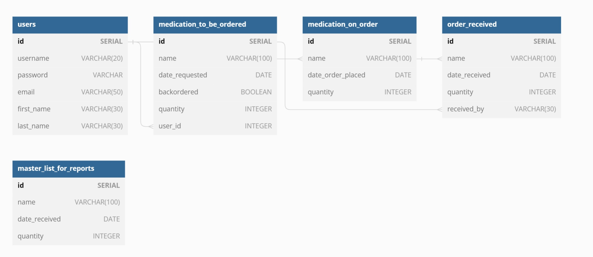

# Drug Order List

## Goal of the Website
The goal of this website is to provide a platform where doctors and managers can retrieve drug information and maintain a drug ordering system. The site will be designed to simplify the drug ordering process and provide relevant drug information.

## Target Users
The website will target doctors and managers who require an easy-to-use system for ordering drugs and managing drug information. The demographic of users is professionals in the medical field.

## Data to be Used
The website will use the OpenFDA API to retrieve relevant drug information. The information will be used to create a database that will store drug orders, drug information, and order status.

## Security
There is no sensitive information that needs to be secured.

## Functionality
The website will include the following functions:
- List function: displays a list of drugs available for order
- Drug data function: provides relevant information about each drug
- Reports function: generates reports based on the data in the database

## User Flow
The user flow will consist of a split-screen with buttons at the top and bottom. The top will contain the list of drugs, and the bottom will display the relevant drug information and order status.

## Database
